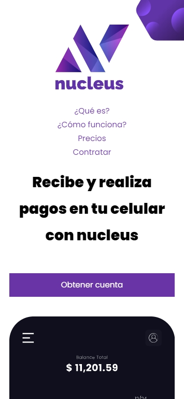
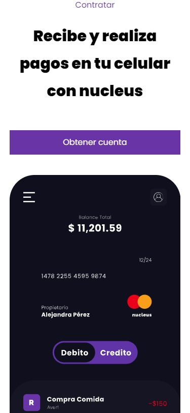
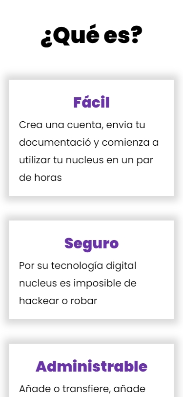
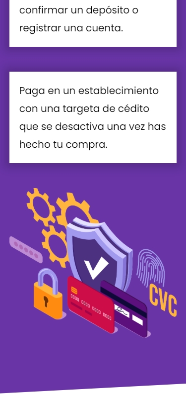
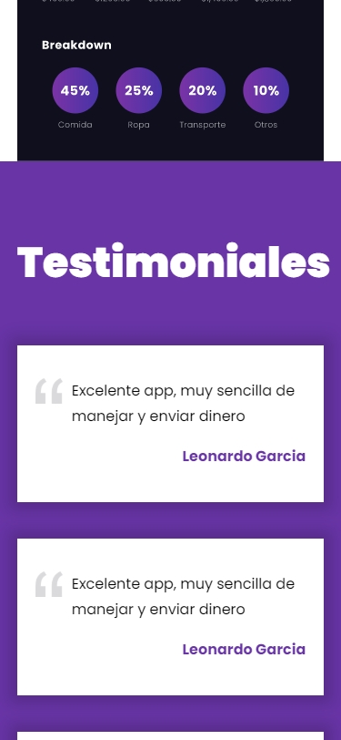

# Proyecto HTML / CSS / BEM "Nucleus E-Wallet"

## Información

-Diseñar una página web con HTML desde cero  completamente responsive.  
-Dar estilo con Css utilizado distintas variables (Grid, FelxBox, MediaQuery) 
-Utilizar el método BEM 
-Mejorar el rendimiento utilizando imágenes .avif, .webp, .jpg (dependiendo de cuales navegadores soporten cada formato) 
-Diseño popular en sitios web contemporáneos 
-NOTA: Este es el tercer proyecto de HTML / CSS
  

## Link:  https://segundoproyectotechpro.netlify.app 
 

## Web

    
    
    
    
    

 

## Phone
  

      
         
      
      
      
  

  ## Link:  https://segundoproyectotechpro.netlify.app